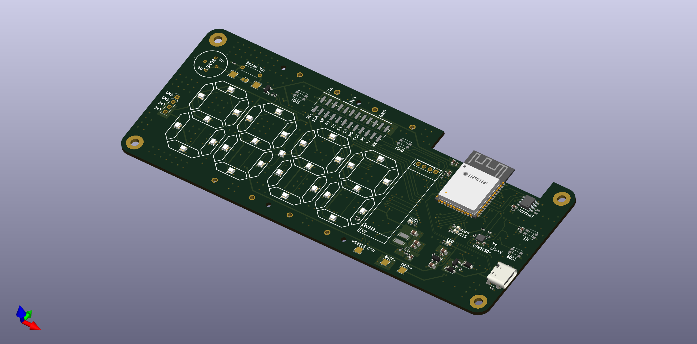
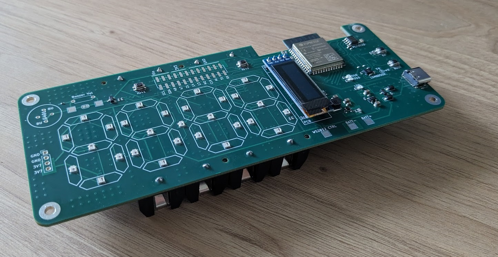

# ESP32 S3 Alarm Clock PCBA
I used KiCAD to design an ESP32S3 based alarm clock. It includes an IMU (LSM6DSOX), a RTC (PCF8523) and 29 WS2812-2020 LEDs for showing the time via 7 segment digits. The PCB was manufactured and assembled via JLCPB. This repository includes the schematic, layout and Arduino script for testing the various functions on the board. The firmware based on ESP-IDF is still in progress.

## Table of Contents
- [Schematic](#schematic)
- [Additional Notes](#additional-notes)

## Schematic
[Schematic Folder](./PCB/Schematic/)

The current schematic inlcudes some observations that I have made. For instance, I heard a high pitched noise from the switching regulator section, and that I could have added a switch to cut power to the whole board.

## Additional Notes
I used solidworks to design the dimensions of the 7-segment LED display, and converted it to a .dxf file format - [LED_Mapping.DXF](./LED_Mapping.DXF). This file was converted to a footprint and was used as a guide for the placement of LEDs.

